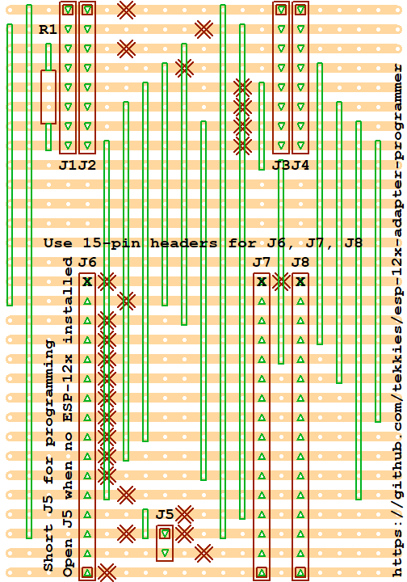

# esp-12x-adapter-programmer

Allows a NodeMCU V2 or NodeMCU V3 to program or emulate a ESP-12E/ESP-12F DIL carrier

**TIP:** If you have trouble programming, unplug the USB cable and try again

 

* Short J5 to program ESP-12x
* Short J5 to monitor ESP-12x DIL carrier
* Leave J5 open to emulate ESP-12x DIL carrier when no DIL Carrier installed
